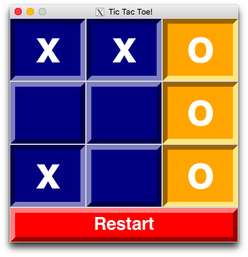

# Tic-Tac-Toe!

A two-player tic-tac-toe game

## Starting the Game

`python tictac.py`

## Requirements

[Tkinter](https://wiki.python.org/moin/TkInter)

## App Version (macOS)

This will create an application called `Tic-Tac-Toe` in the Launchpad using [`py2app`](https://py2app.readthedocs.io/en/latest/).

```
cd app/
make
```

## Screenshots

<p float="left">
  
   
  
</p>
