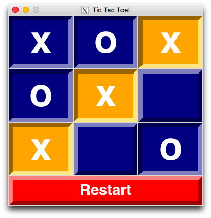

# Tic-Tac-Toe!

A two-player tic-tac-toe game

## Starting the Game

`python Tic-Tac-Toe.py`

## Requirements

[Tkinter](https://wiki.python.org/moin/TkInter)

## App Version (MacOS)

This will create an application called `Tic-Tac-Toe` in the Launchpad using `py2app`.

```
cd app/
make
```

## Screenshots


